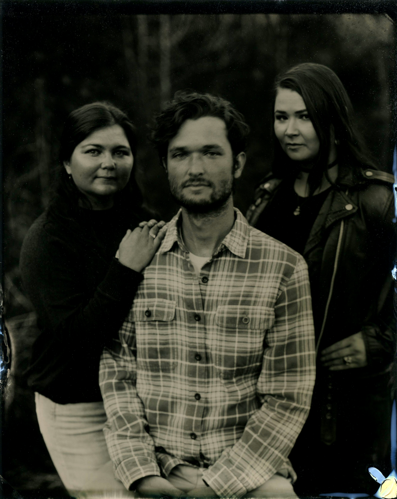

<h2>Long Story (not so) Short...</h2>

I grew up in Tennessee and spent a lot of time running around the woods. My interest in nature eventually landed me in the Biology program at East Tennessee State University, where I crossed paths with Thomas Jones (TJ). He asked me what I'd like to do with my life, and I ended up getting a crash-course on the behavioral ecology of arachnids, including some work on the foraging behavior of social spiders.

I stuck around the [Jones Lab](https://www.facebook.com/#!/ETSUSpiderLab?fref=ts) for a master's degree, where I focused on how predation risk and prey abundance shape daily rhythms of behavior. I became increasingly interested in how the evolution of animal behavior affects population-level processes (particularly reproductive isolation and speciation). This is also when I was first introduced to mathematical models in ecology and evolution, and I got the bug <i>bad</i>. 

I wanted to expand my research to not only consider behavior <i>per se</i>, but also how population-level processes depend on individuals' behaviors. As a PhD student in [Eileen Hebets](https://hebetslab.unl.edu/) and [Brigitte Tenhumberg](https://www.unl.edu/btenhumberg/home)'s labs at the University of Nebraska-Lincoln, I studied the evolution of mate choice behaviors and their consequences for intraspecific divergence in sexual traits in <i>Schizocosa</i> wolf spiders. 

After my PhD, I did a short postdoc with [John DeLong](http://johnpauldelong.weebly.com/) and [Clay Cressler](https://cressler.weebly.com/) at the University of Nebraska in which I developed eco-evolutionary models to study the effect of evolution on unstable coexistence in ecological communities. In my current postdoc with [Courtney Fitzpatrick](https://fitzpatrickresearch.com/) at Texas A&M, I use population genetic models to study the evolution of female ornaments through social benefits.

<h2>Fun Stuff</h2>

When I'm not in the lab, you can find me hiking with my wife, Cecile, and our dog, Yuki, or enjoying the company of our cat, the girl who has no name. I love music, so we almost always have a record playing at our house. I also enjoy making music with friends and skateboarding when my aging back allows.


Coming Soon!

